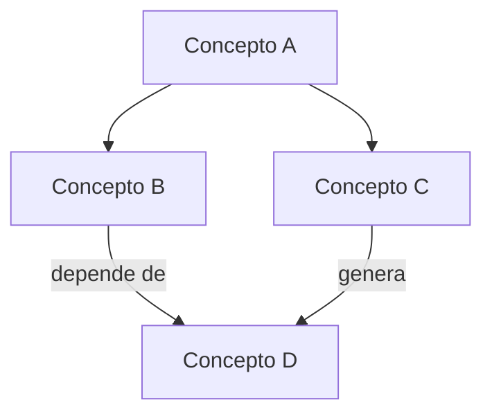

# Skill: mapa-de-nodos

Extrae conceptos clave de cualquier texto y los organiza como un grafo de nodos interconectados.

## Cuándo usar cada formato

| Formato | Cuándo elegirlo |
|---------|----------------|
| **HTML interactivo** (vis.js) | Más de 8 nodos, quiere explorar arrastrando, colores por categoría |
| **Mermaid** | Menos de 8 nodos, quiere pegarlo en Obsidian/Notion, jerarquía clara |

Por defecto: usa **HTML interactivo**. Si la usuaria dice "Mermaid", "Obsidian" o "simple", usa Mermaid.

## Proceso de extracción

### Paso 1: Leer el input
Acepta cualquier forma de input:
- Texto pegado
- Archivo (ruta proporcionada)
- Conversación resumida
- Lista de ideas

### Paso 2: Extraer nodos
Para cada concepto importante:
- `id`: número único
- `label`: nombre corto (1-3 palabras)
- `title`: descripción en tooltip (1 oración)
- `group`: categoría temática (asigna un nombre de grupo coherente)

**Reglas:**
- Máximo 25 nodos para legibilidad
- Un nodo = un concepto único, no una oración
- Agrupa conceptos relacionados en el mismo `group`
- Elimina duplicados y fusiona sinónimos

### Paso 3: Extraer aristas
Para cada relación entre nodos:
- `from` / `to`: ids de los nodos
- `label`: verbo o relación corta ("depende de", "genera", "contradice", "es parte de")

**Reglas:**
- Solo relaciones directas y significativas
- Máximo 2-3 palabras por etiqueta de arista
- Evita aristas que solo repiten la jerarquía obvia

### Paso 4: Asignar colores por grupo
Elige colores distintos por grupo usando esta paleta base:
```
grupo 0: #7C3AED (morado)
grupo 1: #0EA5E9 (azul)
grupo 2: #10B981 (verde)
grupo 3: #F59E0B (naranja)
grupo 4: #EF4444 (rojo)
grupo 5: #EC4899 (rosa)
grupo 6: #6366F1 (índigo)
```

## Generar HTML interactivo (vis.js)

Cuando eliges HTML, genera un Artifact con este template. Rellena `NODES_DATA` y `EDGES_DATA` con los datos extraídos.

```html
<!DOCTYPE html>
<html lang="es">
<head>
  <meta charset="UTF-8">
  <title>Mapa de nodos</title>
  <script src="https://unpkg.com/vis-network/standalone/umd/vis-network.min.js"></script>
  <style>
    body { margin: 0; background: #0f0f1a; font-family: system-ui, sans-serif; }
    #controls { padding: 12px 20px; background: #1a1a2e; display: flex; gap: 10px; align-items: center; flex-wrap: wrap; }
    #controls label { color: #a0a0c0; font-size: 13px; }
    #controls input { background: #2a2a4a; border: 1px solid #3a3a6a; color: white; padding: 4px 10px; border-radius: 6px; }
    #mynetwork { width: 100%; height: calc(100vh - 56px); }
    #legend { position: absolute; top: 70px; right: 16px; background: #1a1a2ecc; padding: 12px; border-radius: 8px; color: white; font-size: 12px; }
    #legend h4 { margin: 0 0 8px; font-size: 13px; color: #c0c0e0; }
    .leg-item { display: flex; align-items: center; gap: 6px; margin-bottom: 4px; }
    .leg-dot { width: 12px; height: 12px; border-radius: 50%; }
  </style>
</head>
<body>
<div id="controls">
  <label>Buscar: <input id="search" placeholder="nodo..." oninput="highlight()"></label>
  <label><input type="checkbox" id="labels" checked onchange="toggleLabels()"> Etiquetas aristas</label>
</div>
<div id="mynetwork"></div>
<div id="legend"></div>
<script>
const NODES_DATA = [/* INSERTAR NODOS */];
const EDGES_DATA = [/* INSERTAR ARISTAS */];

const GROUP_COLORS = {
  0: "#7C3AED", 1: "#0EA5E9", 2: "#10B981",
  3: "#F59E0B", 4: "#EF4444", 5: "#EC4899", 6: "#6366F1"
};

const nodes = new vis.DataSet(NODES_DATA.map(n => ({
  ...n,
  color: { background: GROUP_COLORS[n.group % 7] || "#7C3AED",
           border: "#ffffff22",
           highlight: { background: "#ffffff", border: "#ffffff" } },
  font: { color: "#ffffff", size: 14 },
  shape: "box", borderRadius: 8,
  margin: { top: 8, bottom: 8, left: 12, right: 12 }
})));

const edges = new vis.DataSet(EDGES_DATA.map(e => ({
  ...e,
  color: { color: "#4a4a7a", highlight: "#a0a0ff" },
  font: { color: "#8080a0", size: 11, align: "middle" },
  smooth: { type: "continuous" },
  arrows: { to: { enabled: true, scaleFactor: 0.6 } }
})));

const net = new vis.Network(
  document.getElementById("mynetwork"),
  { nodes, edges },
  {
    layout: { improvedLayout: true },
    physics: { stabilization: { iterations: 150 },
               barnesHut: { gravitationalConstant: -3000, springLength: 160 } },
    interaction: { hover: true, tooltipDelay: 200 }
  }
);

function highlight() {
  const q = document.getElementById("search").value.toLowerCase();
  nodes.forEach(n => {
    const match = q && n.label.toLowerCase().includes(q);
    nodes.update({ id: n.id, opacity: q ? (match ? 1 : 0.2) : 1 });
  });
}

function toggleLabels() {
  const show = document.getElementById("labels").checked;
  edges.forEach(e => edges.update({ id: e.id, font: { ...e.font, color: show ? "#8080a0" : "transparent" } }));
}

// Build legend
const groups = {};
NODES_DATA.forEach(n => { groups[n.group] = groups[n.group] || n.group; });
const leg = document.getElementById("legend");
leg.innerHTML = "<h4>Grupos</h4>" + NODES_DATA
  .filter((n, i, a) => a.findIndex(x => x.group === n.group) === i)
  .map(n => `<div class="leg-item"><div class="leg-dot" style="background:${GROUP_COLORS[n.group%7]}"></div>${n.group_name || "Grupo "+n.group}</div>`)
  .join("");
</script>
</body>
</html>
```

## Generar Mermaid

Cuando eliges Mermaid, genera el diagrama en un code block dentro de la respuesta:



Para mapas más complejos usa `graph LR` (izquierda a derecha).

## Cómo reportar el resultado

1. Muestra el mapa (Artifact para HTML, code block para Mermaid)
2. Lista los grupos temáticos encontrados (2-3 líneas)
3. Menciona los 2-3 nodos más conectados (los más relevantes)
4. Ofrece: "¿Quieres agregar nodos, cambiar grupos o exportar como imagen?"

## Ejemplo de input/output

**Input:** "Tengo ideas para el canal: contenido de Popi, shorts de Luna, recetas para perros, detrás de cámaras, colaboraciones con marcas, monetización con afiliados, merch de las perritas"

**Extracción:**
- Nodos: Popi (contenido), Luna (shorts), Recetas, Behind the Scenes, Collabs marcas, Afiliados, Merch
- Grupos: "Contenido" (Popi, Luna, BTS), "Monetización" (Afiliados, Collabs, Merch), "Especial" (Recetas)
- Aristas: Popi → genera → Merch; Recetas → atrae → Collabs marcas; etc.
